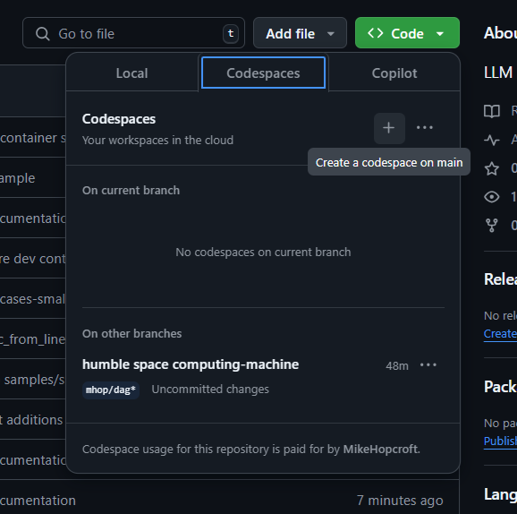
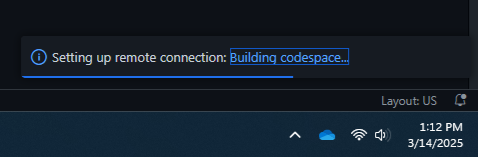
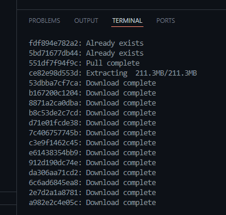
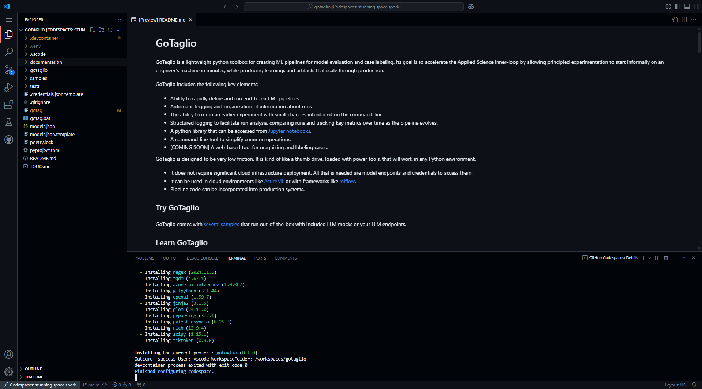
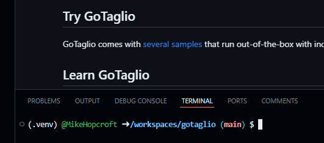

# Using GitHub Codespaces

The easiest way to try out the `ts_type_filter` samples is in a [GitHub Codespace](https://github.com/features/codespaces). This approach spins up a fully configured dev container connected to an instance of [Visual Studio Code](https://code.visualstudio.com/), running in your browser. 

Go to the repo at [https://github.com/MikeHopcroft/ts_type_filter](https://github.com/MikeHopcroft/ts_type_filter).

Locate the green `Code` menu and choose the `Codespaces` tab. Press the `+` button to create a new Codespace based on this repo.

A browser tab will open with a remote web instance of Visual Studio Code, connected to a virtual machine in the cloud. It may take a few minutes for the environment to start.

You can click on the `Building codespace...` link in the lower right corner to see the devcontainer initialization process:

It pulls a bunch of container layers and then installs [PyPi](https://pypi.org/) dependencies.

Here's the codespace, ready to go. You are ready to go with the built in model mocks.

## Virtual Environment

The `ts_type_filter` codespace is configured to use a virtual environment in the `.venv` folder. The `~/.bashrc` should ensure the virtual environment is activated. In the codespaces devcontainer, you can see `(.venv)` at the beginning of the prompt. This indicates that the virtual environment in `.venv` is active:

You can also verify the virtual environment activation as follows:
~~~sh
if [[ -n "$VIRTUAL_ENV" ]]; then
    echo "Virtual environment is active: $VIRTUAL_ENV"
else
    echo "No virtual environment is active."
fi
~~~

If you run into import problems, check to see if the virtual environment is activated for your toolchain.
